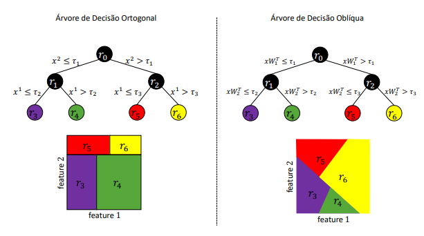
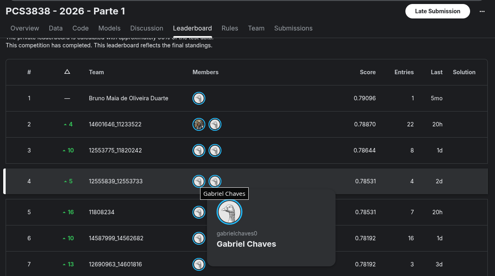

# PCS 3838 - Inteligência Artificial
## **Trabalho Prático 1: Floresta de Decisão Oblíqua (*Oblique Random Forest* - oRF)**

**Escola Politécnica da Universidade de São Paulo (USP)**  
*Departamento de Engenharia de Computação e Sistemas Digitais (PCS)*

---

## 📋 Descrição do Trabalho

Neste trabalho prático, o objetivo é implementar uma forma de criar uma **Floresta de Decisão Oblíqua** (*Oblique Random Forest* – **oRF**). 

Neste classificador, as árvores que compõem a floresta são **Árvores de Decisão Oblíquas** (*Oblique Decision Tree* – **oDT**). Diferentemente das árvores de decisão ortogonais tradicionais, onde os *splits* consideram uma única *feature* por vez, as árvores de decisão oblíquas (oDTs) particionam o espaço por meio de hiperplanos/projeções definidos por combinações, tipicamente, lineares das *features* (ex: $xW^T$).

> [!IMPORTANT]
> **Regra Crucial de Implementação:**  
> Você deve definir os hiperplanos **em cada nó da árvore**. Ou seja, **não é permitido** projetar previamente o conjunto de dados (por exemplo, obter $X = XW^T$ ou $x = xW^T$ globalmente) e, em seguida, treinar uma árvore ortogonal tradicional. Cada nó deve aprender/definir seu próprio hiperplano/projeção local.

A forma de construção dos hiperplanos é livre (por exemplo: projeções lineares aleatórias, PCA, LDA, PLS, CCA, projeção no hiperplano do SVM, entre outros), desde que esteja claramente descrita no relatório.

---

## 📐 Comparação: Ortogonal vs. Oblíqua

A diferença conceitual na partição do espaço de características e na estrutura das duas abordagens é ilustrada na imagem abaixo:

<p align="center">
  
</p>

---

## 📊 Tabela Comparativa Geral

A tabela abaixo sumariza as principais diferenças gerais entre uma árvore ortogonal e uma oblíqua (esta tabela serve como referência geral de design e não precisa ser seguida ao pé da letra):

| Componente | Ortogonal | Oblíqua |
| :--- | :--- | :--- |
| **Estrutura do Nó** | $i^*$, $\tau^*$ | $w$, $\tau^*$ |
| **Regra de Split** | $x^i \le \tau$ | $\langle w, x \rangle \le \tau$ |
| **Busca de Split** | <pre>for j in range(m):<br>    thresholds = unique(X[:, j])<br>    for th in thresholds:</pre> | <pre>w = ????<br>z = X @ w<br>thresholds = unique(z)<br>for th in thresholds:</pre> |
| **Separação de Dados** | <pre>Xi_left = X[X[:, j] <= th]<br>Xi_right = X[X[:, j] > th]</pre> | <pre>z = X @ w<br>Xi_left = X[z <= th]<br>Xi_right = X[z > th]</pre> |
| **Previsão** | <pre>if x[i*] <= &tau;*:<br>    return prediction(x, node.left)</pre> | <pre>z = x @ w<br>if z <= &tau;*:<br>    return prediction(x, node.left)</pre> |
| **Tipo de Fronteira** | *Axis-aligned* (Alinhada aos eixos) | Hiperplano oblíquo |

---

## 🚀 Avaliação & Regras de Entrega

Após implementar sua **oRF**, você deve:
1. **Avaliar seu desempenho** na competição do Kaggle da disciplina.
2. **Comparar a abordagem** com uma Random Forest ortogonal (tradicional), considerando o compromisso entre **habilidade preditiva** (ex. acurácia) e **custo computacional** (ex. tempo de treinamento e/ou predição).
   - *Nota:* Pode-se utilizar bases de dados sintéticas ou qualquer outro conjunto de dados de sua escolha (bases sintéticas facilitam o controle do tamanho dos dados para análise).

### 📦 Itens a serem entregues:
- **(i) Relatório** (máximo de 2 páginas utilizando o template do e-disciplinas).
- **(ii) Submissão no Kaggle** utilizando a oRF proposta.
- **(iii) Código-fonte** em um único arquivo `.py` contendo a sua implementação da oRF.

> [!WARNING]
> **Importante:** Não será permitida a entrega de implementações prontas de oRFs. É permitido, contudo, o uso de bibliotecas (ex. *scikit-learn* ou *numpy*) para o cálculo das projeções (ex: calcular o PCA ou treinar o SVM do nó). Qualquer violação destas instruções pode acarretar em **nota zero**.

---

## 🏆 Ranking no Kaggle

Este projeto ficou em terceiro lugar dos grupos(excluindo o aluno Bruno de doutorado) dentre 42 trabalhos enviados de alunos da graduação.
O desempenho obtido na competição do Kaggle e a colocação correspondente podem ser visualizados abaixo:

<p align="center">
  
</p>

---

## 📝 Estrutura do Relatório (Máx. 2 páginas)

O relatório deve conter os seguintes itens:
1. **Definição de hiperplanos**: Como foram definidos os hiperplanos em cada nó da oDT (ex: método utilizado para gerar os $W$ da imagem);
2. **Parâmetros da oDT**: Como foram definidos os parâmetros (medida de impureza e critérios de parada de crescimento da árvore) para a criação da oDT;
3. **Parâmetros da oRF**: Como foram definidos os parâmetros (número de árvores, estratégia de amostragem, estratégia para combinação das previsões, etc.) para a criação da oRF;
4. **Habilidade Preditiva vs. Custo Computacional**: Qual foi o compromisso de desempenho e tempo da oRF proposta comparada à Random Forest ortogonal tradicional;
5. **Requisitos adicionais**: Se a sua implementação exigir pacotes adicionais (*requirements*), detalhe no relatório quais são os pacotes e suas respectivas versões.

---

## 💻 Estrutura Sugerida para o Código

O arquivo `.py` de entrega deve possuir uma estrutura similar ao código abaixo:

```python
# ...

def main():
    X, y = make_classification(...)  # or make_moons, make_blobs...
    X_train, X_test, y_train, y_test = train_test_split(X, y, ...)
    model = oRF(.....)
    model.fit(X_train, y_train)
    y_hat = model.predict(X_test)
    accuracy_score(y_test, y_hat)

main()
```

---

## 📚 Sugestões de Leitura (Opcionais)

1. Sarwesh Rauniyar. **Jacobian Aligned Random Forests**. International Conference on Learning Representations (ICLR), 2026.
2. Menze et al. **On Oblique Random Forests**. ECML PKDD, 2011.
3. O’Reilly. **Statistical Advantages of Oblique Randomized Decision Trees and Forests**. ArXiv, 2025.
4. Nam et al. **Local Decorrelation for Improved Pedestrian Detection**. NeurIPS, 2014.